# SEM Group Project

[Zube](https://zube.io/napier-232/corrie-resit/w/workspace-1/kanban)

by Corrie

## Overview
The application:
- Creates a docker container with the world database open for connections
- Prompts the user in the console to select a report type
- Runs SQL queries against the database that generate the user's requested report
- Presents the output to the user
- Allows the user to exit at any point in the process
- Loops back to allow the user to select another query

## Requirements Met

8 requirements of the 8 requirements have been implemented, which is 100%.

| Queries  | Name                                                                          | Screenshots                                      |
|----------|-------------------------------------------------------------------------------|--------------------------------------------------|
| Query1.1 | All the countries in the world organised by largest population to smallest.   | 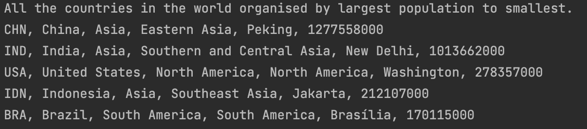  |
| Query1.2 | All the countries in a continent organised by largest population to smallest. | 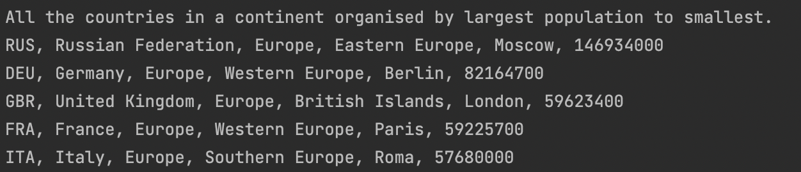  |
| Query1.3 | All the countries in a region organised by largest population to smallest.    | 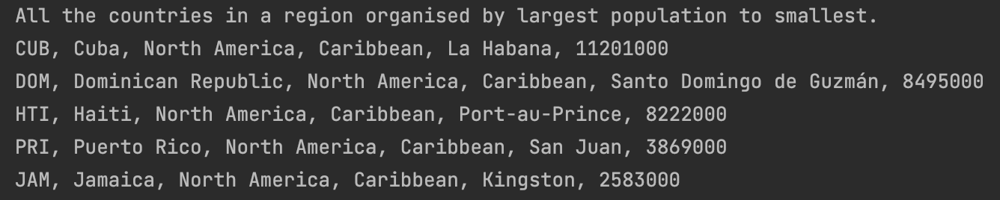  |
| Query2.1 | The top N populated countries in the world where N is provided by the user.   | 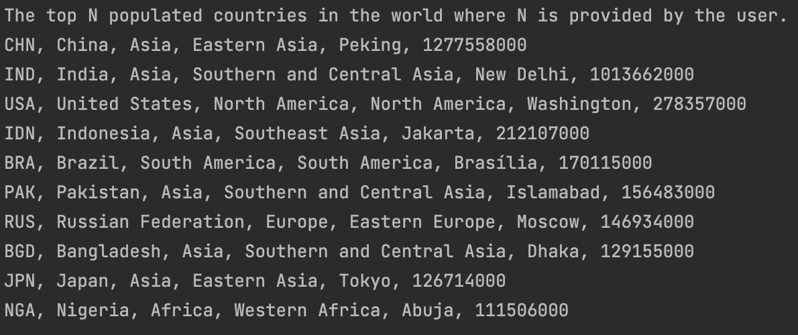  |
| Query2.2 | The top N populated countries in a continent where N is provided by the user. | 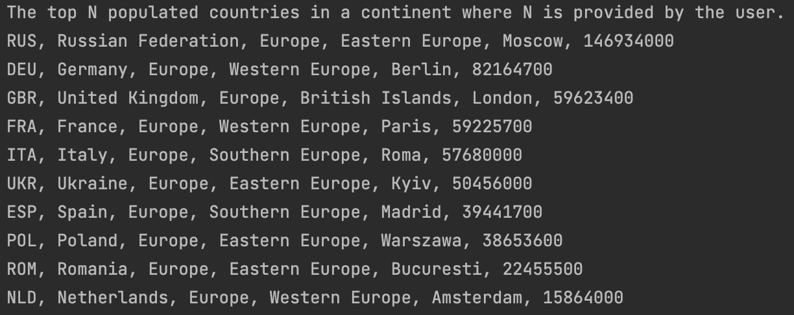  |
| Query2.3 | The top N populated countries in a region where N is provided by the user.    | 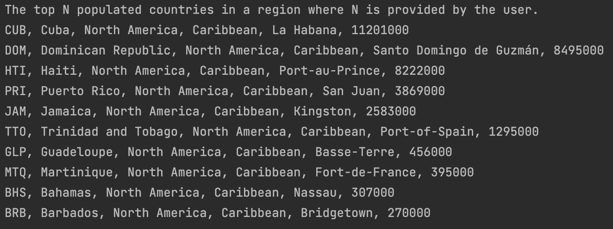  |
| Query3.1 | All the cities in the world organised by largest population to smallest.      | 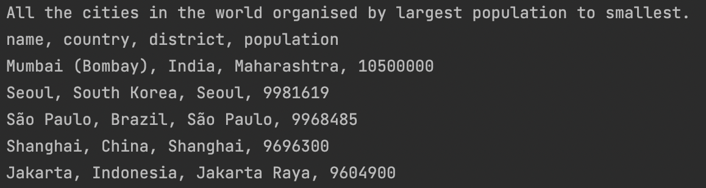  |
| Query3.2 | All the cities in a continent organised by largest population to smallest.    | 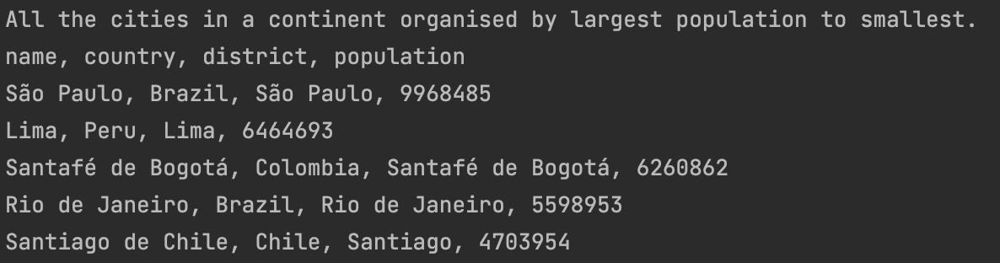  |
| Query3.3 | All the cities in a region organised by largest population to smallest.       | 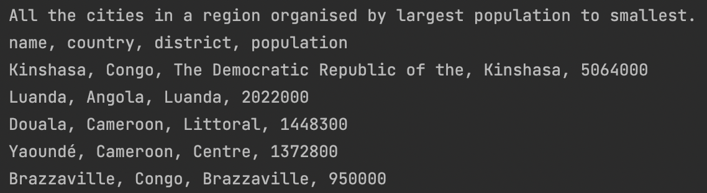  |
| Query3.4 | All the cities in a country organised by largest population to smallest.      | 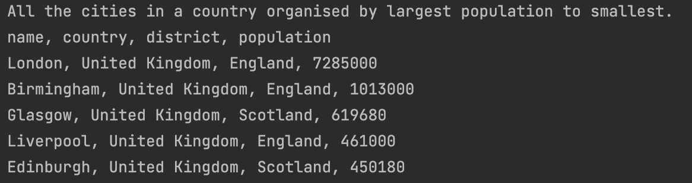 |
| Query3.5 | All the cities in a district organised by largest population to smallest.     | 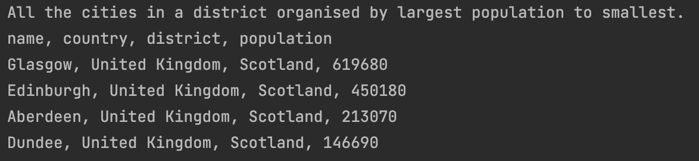 |
